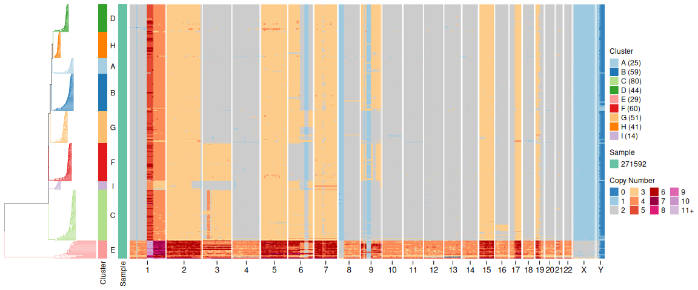
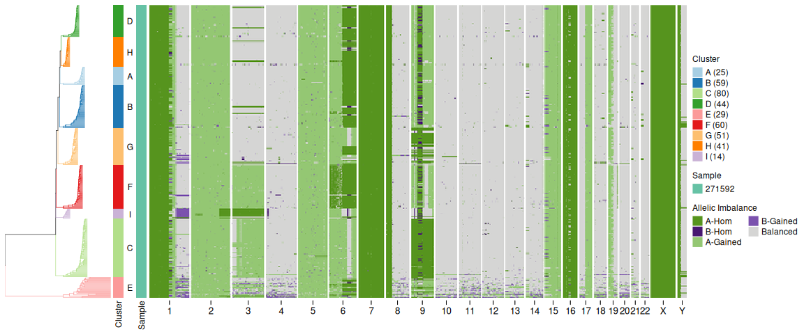
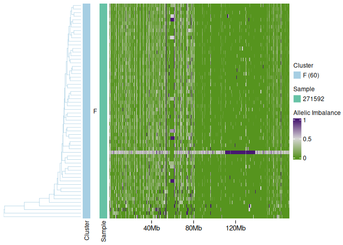
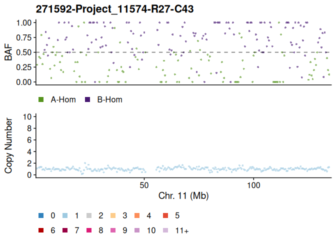
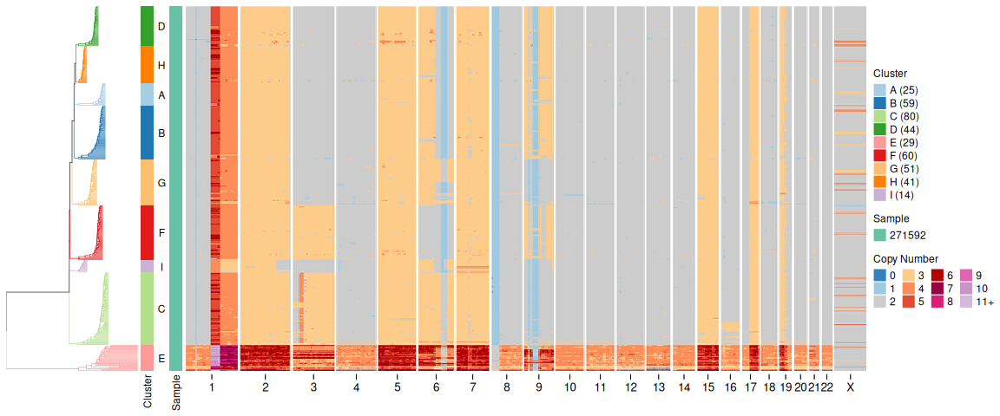
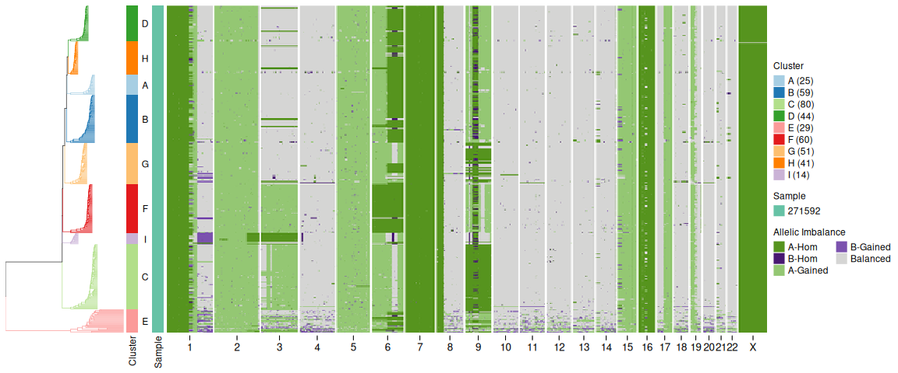
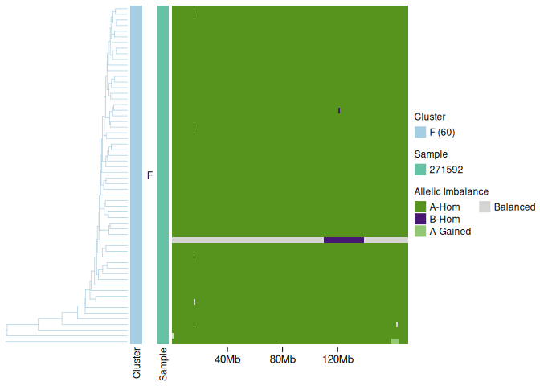
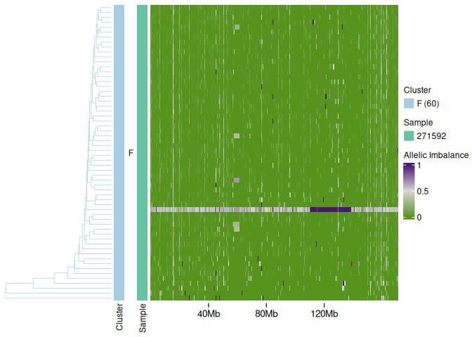
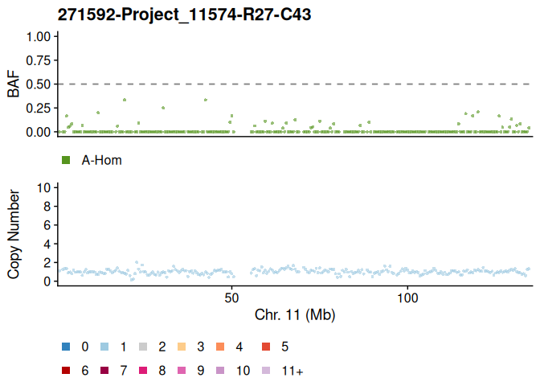

# Fixing phasing issues in signals

2026-02-03

## Background

Sometimes the cluster of cells signals identifies to use for phasing is
non-optimal. As a reminder, signals attempts to find a (possibly small)
cluster of cells that has allelic imbalance across a whole chromosome,
if no cluster exists with allelic imbalance across the whole chromosome
it will (attempt) to use the cluster with the greatest fraction of
allelic imbalance.

Sometimes this fails and there are obvious populations that should be
used instead. The workaround here is to specify to signals which cells
to use for phasing for each chromosome.

## Example: 80408

In this example, chr6p looks problematic.

``` r
library(data.table)
library(tidyverse)
devtools::load_all("/home/william1/bin/R/signals")
rdata <- readRDS("/data1/shahs3/isabl_data_lake/analyses/00/10/50010/results/signals.Rdata")
cl <- leiden_clustering(rdata$hscn$data, tree = "cell", seed = 123, resolution = 2)
```

### Heatmaps

``` r
plotHeatmap(rdata$hscn$data, 
            tree = cl$tree, 
            clusters = cl$clustering, 
            rasterquality = 1)
```



``` r
plotHeatmap(rdata$hscn$data, 
            tree = cl$tree, 
            plotcol = "state_phase",
            clusters = cl$clustering, 
            rasterquality = 1)
```



### Chr 6 heatmaps

Zooming in on chr6 specifically.

``` r
cells_to_keep <- cl$clustering %>% filter(clone_id == "F") %>% pull(cell_id)
plotHeatmap(rdata$hscn$data %>% filter(cell_id %in% cells_to_keep) %>% filter(chr == "6"), 
            tree = cl$tree %>% ape::keep.tip(cells_to_keep), 
            plotcol = "state_phase",
            clusters = cl$clustering%>% filter(clone_id == "F"), 
            rasterquality = 1)
```


``` r
plotHeatmap(rdata$hscn$data %>% filter(cell_id %in% cells_to_keep) %>% filter(chr == "6"), 
            tree = cl$tree %>% ape::keep.tip(cells_to_keep), 
            plotcol = "BAF",
            clusters = cl$clustering%>% filter(clone_id == "F"), 
            rasterquality = 1)
```



## Adjust the phasing

In the signals object there is a named list in slot `rdata$hscn$phasing`
which records the cells used for phasing. If we’re happy with most of
the chromosomes, we can take this and adjust for any chromosomes we
think could be improved. In this case, we’ll swap chr6 for the cluster
of cells (cluster F) that looks to be entirely LOH.

``` r
phasing <- stack(rdata$hscn$phasing) %>% 
  rename(chr = ind, cell_id = values)
phasing <- filter(phasing, chr != "6")

phasing_chr6 <- cl$clustering %>% 
  filter(clone_id == "F") %>% 
  select(cell_id) %>% 
  mutate(chr = "6")

phasing <- bind_rows(phasing, phasing_chr6)
```

We can also see that in clone G, there is one cell with a whole
chromosome loss on chr11. We can see that the phasing has not worked
because we see oscillating green/purple in the haplotype specific state.
In addition to the chr6 cells, we’ll also use this cell to phase
chromosome 11. Using a single cell may not always work well as it will
depend somewhat on the coverage in that cell, however a whole chromosome
loss generally has the highest signal and can often work well.

``` r
#find the cell
rdata$hscn$data %>% 
  filter(chr == "11") %>% 
  group_by(cell_id) %>% 
  summarize(frac_state_1 = sum(state == 1) / dplyr::n()) %>% 
  arrange(desc(frac_state_1)) %>% 
  head()
```

    # A tibble: 6 × 2
      cell_id                      frac_state_1
      <chr>                               <dbl>
    1 271592-Project_11574-R27-C43       1     
    2 271592-Project_11574-R31-C55       0.0849
    3 271592-Project_11574-R26-C59       0.0812
    4 271592-Project_11574-R17-C48       0.0590
    5 271592-Project_11574-R15-C59       0.0517
    6 271592-Project_11574-R16-C18       0.0480

``` r
chr11_cell <- "271592-Project_11574-R27-C43"
plotCNprofileBAF(rdata$hscn$data, cellid = chr11_cell, chrfilt = "11")
```



Now we’ve confirmed we found the correct cell, we’ll add it to the
phasing csv.

``` r
phasing <- filter(phasing, chr != "11")

phasing_chr11 <- data.frame(cell_id = chr11_cell, chr = "11")

phasing <- bind_rows(phasing, phasing_chr11)
```

We’ll then write this to a file to use in the signals script.

``` r
fwrite(phasing, file = "/data1/shahs3/users/william1/projects/signals_isabl/data/cell_list_phasing_80408.csv")
```

We can then rerun signals using this as input:

``` bash
#!/bin/bash
#SBATCH --job-name="signals_%j"
#SBATCH --partition=componc_cpu
#SBATCH --output=logs/signals_%j.log
#SBATCH --nodes=1
#SBATCH --ntasks=4
#SBATCH --mem=64G
#SBATCH --time=24:00:00

mkdir -p logs results/80408_v2

img="/data1/shahs3/users/william1/software/singularity/rstudio-docker_main.sif"

singularity exec --bind=/data1 --bind=/home \
    /data1/shahs3/users/william1/software/singularity/rstudio-docker_main.sif \
    Rscript --vanilla run_signals.R \
    --hmmcopyqc /data1/shahs3/isabl_data_lake/analyses/30/38/33038/results/SHAH_H001757_T01_01_DLP01_hmmcopy_metrics.csv.gz \
    --hmmcopyreads /data1/shahs3/isabl_data_lake/analyses/30/38/33038/results/SHAH_H001757_T01_01_DLP01_hmmcopy_reads.csv.gz \
    --allelecounts /data1/shahs3/isabl_data_lake/analyses/65/94/36594/results/haplotype_calling_count.csv.gz \
    --ncores 5 \
    --mincells 2 \
    --sex MALE \
    --qcplot results/80408_v2/qcplot.png \
    --heatmap results/80408_v2/heatmap.png \
    --heatmapraw results/80408_v2/heatmapraw.png \
    --csvfile results/80408_v2/hscn.csv.gz \
    --qccsvfile results/80408_v2/qc.csv \
    --Rdatafile results/80408_v2/signals.Rdata \
    --chr_cell_list data/cell_list_phasing_80408.csv
```

## Checking the output

Now checking this output we can see it’s much improved.

``` r
rdata_v2 <- readRDS("/data1/shahs3/users/william1/projects/signals_isabl/results/80408_v2/signals.Rdata")
```

``` r
plotHeatmap(rdata_v2$hscn$data, 
            tree = cl$tree, 
            clusters = cl$clustering, 
            rasterquality = 1)
```



``` r
plotHeatmap(rdata_v2$hscn$data, 
            tree = cl$tree, 
            plotcol = "state_phase",
            clusters = cl$clustering, 
            rasterquality = 1)
```



``` r
plotHeatmap(rdata_v2$hscn$data %>% filter(cell_id %in% cells_to_keep) %>% filter(chr == "6"), 
            tree = cl$tree %>% ape::keep.tip(cells_to_keep), 
            plotcol = "state_phase",
            clusters = cl$clustering%>% filter(clone_id == "F"), 
            rasterquality = 1)
```



``` r
plotHeatmap(rdata_v2$hscn$data %>% filter(cell_id %in% cells_to_keep) %>% filter(chr == "6"), 
            tree = cl$tree %>% ape::keep.tip(cells_to_keep), 
            plotcol = "BAF",
            clusters = cl$clustering%>% filter(clone_id == "F"), 
            rasterquality = 1)
```



Finally we’ll check if the phasing for the chr11 cell has improved.

``` r
chr11_cell <- "271592-Project_11574-R27-C43"
plotCNprofileBAF(rdata_v2$hscn$data, cellid = chr11_cell, chrfilt = "11")
```


